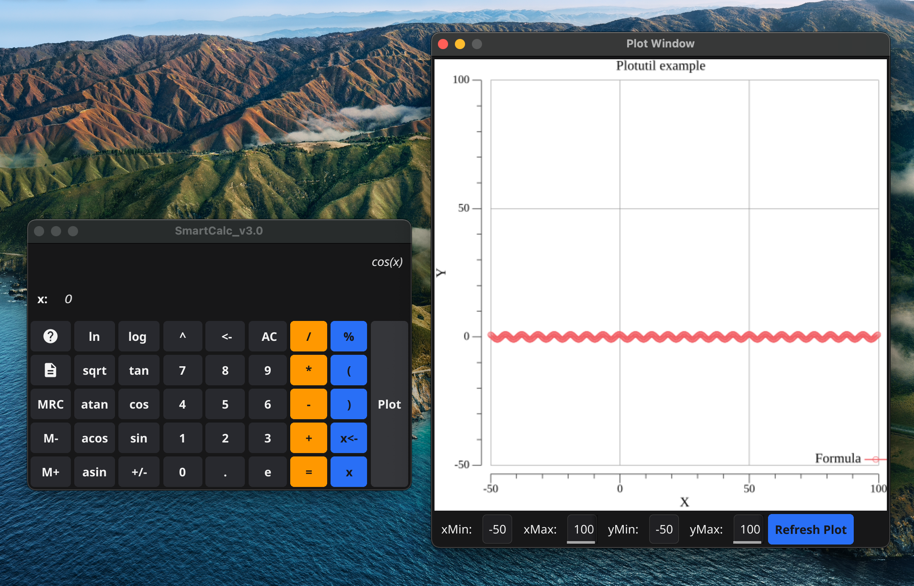
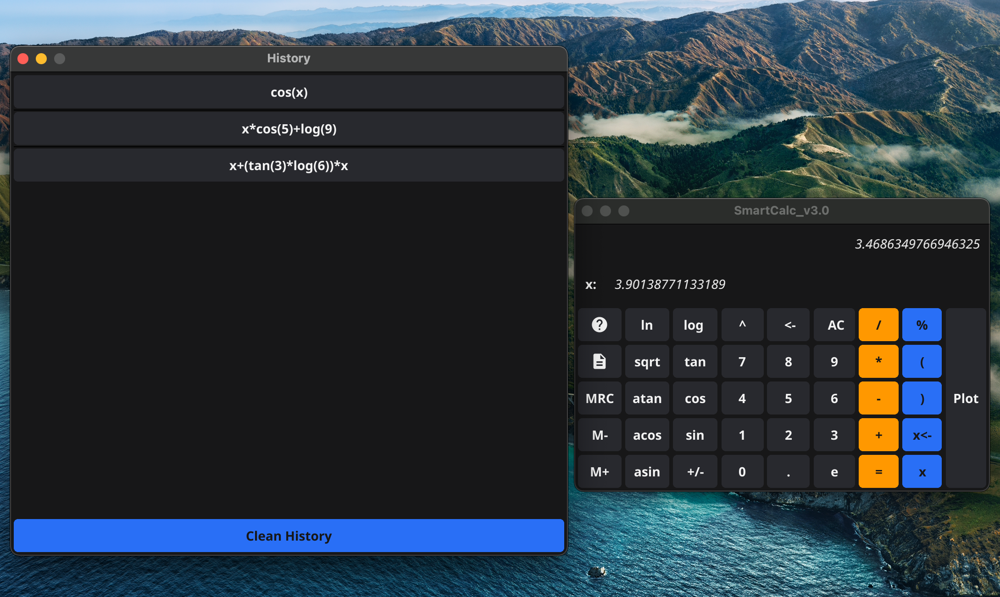

<p align="center">
  <a href="https://docs.fyne.io"></a>
  <a href="https://pkg.go.dev/plugin"></a>
  <a href="https://pkg.go.dev/cmd/cgo"></a>	
</p>

## Описание программы SmartCalc v3.0
#
Программа разработана на языке Golang. Использован инструментарий

для создания графических приложений Fyne. И легаси код проекта

SmartCalc v1.0 на языке C. На вход программы могут подаваться как

целые числа, так и вещественные числа, записанные через точку.

Вычисление производится после полного ввода вычисляемого выражения

и нажатия кнопки "=".



### Зависимости:

golang v 1.21.6

### Установка:
```
make install
```

#
Программа обладает следующим функционалом:

>Вычисление произвольных скобочных арифметических выражений в инфиксной

>нотации;

>Вычисление произвольных скобочных арифметических выражений в инфиксной

>нотации с подстановкой значения переменной "x" в виде числа или выражения;

>Построение графика функции, заданной с помощью выражения в инфиксной

>нотации с переменной "x" (с координатными осями, отметкой используемого

>масштаба и сеткой с адаптивным шагом);

>Сохранение истории операций (позволяет загружать выражения из истории и

>очищать историю целиком).


#
Максимально допустимая длина выражения 255 символов. Проверяемая точность

дробной части - 7 знаков после запятой. Область определения и область

значения функций ограничиваются числами от -100000000 до 100000000
#
Программа поддерживает следующие математечиеские функции:
#
| ***Функция*** | ***Пример*** |
|:-------------|:------------:|
| Скобки        | "(a + b)"    |
|Сложение       | "a + b"      |
|Вычитание      | "a - b"      |
|Умножение      | "a * b"      |
|Деление        | "a / b"      |
|Возведение в степень| "a ^ b" |
|Остаток от деления  | "a % b" |
|Унарный плюс   | "+a"         |
|Унарный минус  | "-a"         |
|Косинус        | "cos(a)"     |
|Синус          | "sin(a)"     |
|Тангенс        | "tan(a)"     |
|Арккосинус     | "acos(a)"    |
|Арксинус       | "asin(a)"    |
|Арктангенс     | "atan(a)"    |
|Квадратный корень | "sqrt(a)" |
|Натуральный логарифм| "ln(a)" |
|Десятичный логарифм | "log(a)"|
#
Для работы в главном окне используйте мышь или тачпад, клавиатура в

данном окне неактивна. Чтобы проинициализировать "Х" нажмите клавишу

"X<-" и выражение или число в главном окне станет его значением.

Значение переменной отображается на экране калькулятора. В дальнейшем

можно подставлять проинициализированную переменную "X" в формулы

нажатием одноименной клавиши. Условно "X" равна нулю.
#
Для работы с графиками введите выражение в главное окно программы

(используйте переменную x если необходимо). Далее нажмите кнопку "Plot"

и отрисованный график появится в новом окне.
